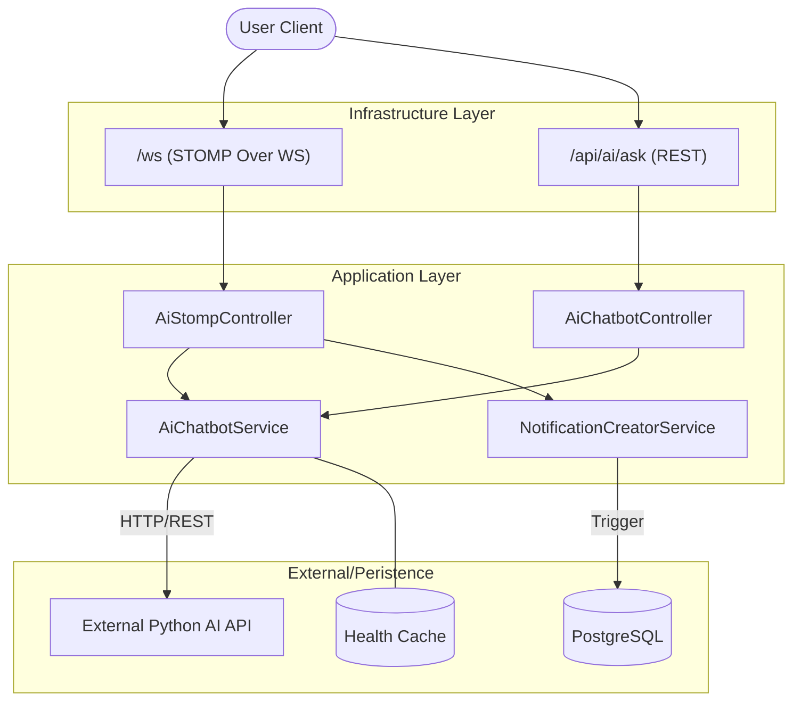

# AI Chatbot Implementation Guide (Complete Reference)

---
**AUDIENCE:** Backend Implementation Team & Architects  
**STATUS:** Production Specification v2.0  
**EXTERNAL_REF:** [../api/ai-chatbot.md](../api/ai-chatbot.md)  
**LAST UPDATED:** 2026-05-06
---

This document provides a comprehensive "A to Z" guide for the AI Chatbot integration in the NeuralHealer project, covering architecture, security, data persistence, and inter-service communication.

## 1. System Architecture (Hybrid Core)

NeuralHealer employs a **Hybrid Delivery Architecture** that balances real-time performance with system reliability.



### 1.1 Messaging Pipeline (STOMP WebSocket)
The system uses the **Spring WebSocket Message Broker** for all real-time AI interactions. Key configuration parameters from `WebSocketConfig.java`:

- **Endpoint**: `/ws` (Standard WebSocket endpoint, no SockJS fallback).
- **Broker Paths**:
    - `/topic`: General broadcast channels.
    - `/queue`: Private user-specific channels.
    - `/app`: Inbound destination prefix for client messages.
    - `/user`: Prefix for routing messages to specifically authenticated user sessions.
- **Heartbeats**: Set to `[10000, 10000]` (**10 seconds**). This maintains connection stability through firewalls and load balancers by ensuring active traffic even during idle inference time.
- **Interceptors**: `WebSocketAuthInterceptor` is registered on the inbound channel to handle per-message or per-connection authentication.

## 2. Component Directory

### 2.1 Communication Controllers
- **`AiStompController.java`**: The primary interaction point.
    - Uses `@MessageMapping("/ai/ask")` to handle structured queries.
    - Manages the **Typing lifecycle** (START -> [AI Logic] -> STOP) to ensure UI responsiveness.
    - Automatically cleans Arabic response prefixes (e.g., removing "الإجابة هي:").
- **`AiChatbotController.java`**:
    - Provides a standard HTTP fallback for simple deployments or debugging.
    - Exposes the `/api/ai/health` endpoint used by health checks and monitoring.

### 2.2 Core Service Layer
- **`AiChatbotService.java`**:
    - Centralizes `RestTemplate` communication with the external Python AI service.
    - **Caching**: Uses `@Cacheable(value = "aiHealthCache")` to avoid hammering the AI service with liveness probes.
    - **Arabic Support**: Explicitly sets `Accept-Charset: UTF-8` and `Content-Type: application/json` to prevent character corruption.
    - **Resilience**: Implements a configurable read timeout (default 300s) to handle slow inference.

## 3. Data Model & Persistence (Stateless Strategy)

### 3.1 Chat Persistence Architecture (Update v2.0)
The Java backend **now persists all AI conversations** to the database with full session and message tracking.

> [!IMPORTANT]
> **Stateful Operation**: The backend maintains full conversation history for context-aware responses. 
> - **Messages are saved** to the `ai_chat_messages` table (async, fire-and-forget)
> - **Sessions are tracked** in the `ai_chat_sessions` table with auto-generated titles
> - **Conversation history** is passed to the AI service for context-aware responses
> - **Voice transcriptions** are persisted when returned by the AI service

**Design Rationale**:
- **Prototyping Speed**: Rapid iteration without database migration overhead.
- **Performance**: Zero DB latency during token streaming or long inference.
- **Privacy by Design**: Minimizing the storage of temporary medical assistant data.

### 3.2 Persistent Records
The AI system generates multiple persistent records:
1. **Chat Messages**: User and AI messages stored in `ai_chat_messages` (async save)
2. **Chat Sessions**: Session metadata in `ai_chat_sessions` with auto-generated titles from first user message
3. **Notifications**: `NotificationCreatorService.createAiNotification()` creates persistent notification records
4. **Voice Transcriptions**: When voice endpoint is used, transcribed text is saved as a message

**Message Types in DB**
- `sender_type: 'patient'` → User messages, voice transcriptions
- `sender_type: 'ai'` → AI responses

**Auto-Generated Titles**
- Extracted from first patient message (first sentence or phrase, max 50 chars)
- Can be manually renamed via `/api/chats/{sessionId}/title` endpoint

## 4. Security Framework (STOMP Security)

Security for AI interactions is multi-layered, bypassing standard HTTP filters for more granular WebSocket control.

### 4.1 Authentication Pipeline
1.  **Handshake**: `SecurityConfig` allows `/ws` to permit connection upgrades.
2.  **Interceptor (`WebSocketAuthInterceptor`)**:
    - Extracts JWT from the `Authorization` header or `neuralhealer_token` cookie.
    - Validates against `UserRepository` via `WebSocketService`.
    - **Guest Access**: Automatically upgrades unauthenticated users to a "Guest" principal (`guest_SESSIONID`) to allow limited testing without login.
3.  **Event Listening (`WebSocketEventListener`)**: Tracks session liveness and maintains an in-memory session registry for telemetry.

## 5. System Integration

### 5.1 Notifications
When a user asks a question via STOMP, the system doesn't just reply; it creates a persistent record:
- **Service**: `NotificationCreatorService.createAiNotification()`
- **Type**: `AI_RESPONSE_READY`
- **Impact**: The user sees a "new notification" badge, ensuring they don't miss the AI summary even if they disconnect during inference.

### 5.2 Error Management
| Scenario | Behavior | Event Sent |
| :--- | :--- | :--- |
| External API Down | Retries then fails gracefully | `AI_ERROR` |
| UI Interruption | System continues processing | Notification created as fallback |
| Encoding Mismatch | Logged as warning | `AI_ERROR` (if corrupted) |

## 6. Development Workflow (A to Z)

1.  **AI Backend**: Python/Flask service must expose `/health` and `/ask`.
2.  **Configuration**: Update `.env` with:
    ```bash
    AI_SERVICE_URL=https://your-ai-service-url
    AI_API_KEY=your-api-key  # Optional
    NGROK_SKIP_BROWSER_WARNING=true  # If using ngrok tunnels
    ```
3.  **STOMP Connection**: Connect to `ws://.../ws`. Subscribe to `/user/queue/ai`.
4.  **Exchange**: Publish to `/app/ai/ask`. Listen for `AI_TYPING_START` -> `AI_RESPONSE` -> `AI_TYPING_STOP`.
5.  **Voice Support**: POST audio files to `/api/ai/voice/{sessionId}` for voice transcription + response.
6.  **Conversation History**: Sessions include previous messages for context; history is passed to AI on each request.
5.  **Analytics**: Monitor `message_queues` (if redirected) or logs for response times.
